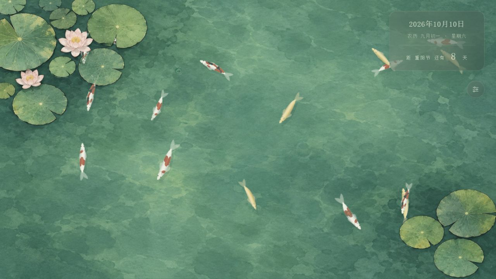

# Zen desktop · 禅意桌面

[简体中文](README.md) | **English**

A quiet moment on your desktop.

An interactive Windows wallpaper focused on calm, space, and gentle motion. The first scene is a top-down koi pond: fish swim, turn, gather around food, and disperse. Light rain creates ripples around floating lotus leaves and flowers. Everything is rendered in real time; this is not a video wallpaper.

Current version: **0.3.7**. Source mirrors: [GitHub](https://github.com/SSYNG/zen-desktop) · [Gitee](https://gitee.com/ssy_kr/zen-desktop).

## Features

- Three koi varieties; select two or three, adjust the population from 6 to 32, and set a baseline speed. Individual fish have different speeds and occasionally dart or turn sharply.
- Click empty desktop space to drop one food pellet. Nearby fish accelerate toward it; a close lateral pellet triggers braking, a sharp tail-driven turn, and a larger wake. Only mouth contact consumes food, after which the school disperses.
- Population changes bring new fish in from beyond the frame and let departing fish swim out, preserving existing fish.
- Optional light rain with drops, subtle crowns, splashes, and expanding, overlapping water ripples.
- Optional calendar with Gregorian and Chinese lunar dates, weekday, and a countdown to the next holiday or solar term.
- Separate wallpaper and application settings, translucent panels, subtle hover movement, and smooth opening and closing transitions.
- Custom local music with playback and volume controls. The application stays silent until music is selected.
- Launch directly onto the desktop with settings closed. Double-click empty desktop space to toggle icons; a normal exit makes desktop icons visible.
- Rendering follows refresh callbacks with a fallback frame clock for desktop callback stalls. There is no fixed frame-rate setting; actual performance depends on hardware and window scheduling.

Rain, ocean, snowy forest, and bamboo-path scenes are placeholders for future development.

## Run

Windows 10 / 11 x64. Electron / Chromium is bundled, so WebView2 is not required. The native desktop bridge requires .NET Framework 4.8.

1. Extract the entire portable archive and keep all files together.
2. Double-click ZenDesktop.exe to attach the wallpaper to the primary monitor.
3. Open settings using the upper-right button or system tray. Closing settings keeps the wallpaper running.
4. Exit from the tray menu or the bottom of the settings panel.

Defaults: 16 fish, all three varieties, speed multiplier 0.8, calendar enabled, rain and sound disabled. Settings persist in %APPDATA%\ZenDesktop-Electron. Custom music is stored in IndexedDB within that user data directory.

The portable archive is approximately **156 MiB**, or **371 MiB** extracted. Local dist/ retains only the latest 0.3.7 and previous 0.3.6 folders and ZIP files. Build artifacts are excluded from Git; build from source after cloning. No remote release binaries were published in this round.

To preview in a normal window without attaching to the desktop or changing icons:

    .\ZenDesktop.exe --preview

## Development

Windows, Node.js **22.12 or later**, npm, and the Windows .NET Framework C# compiler are required. Tested with Node.js 22.13.1. Python and Pillow are needed only to regenerate the icon; normal builds use the committed icon.

    npm ci
    npm run preview       # Browser preview: http://127.0.0.1:5173
    npm test              # Simulation and audio lifecycle tests
    npm run build         # Compile the bridge and package Windows x64
    npm run desktop       # Run Electron after the bridge has been generated

The first install or build downloads the Electron runtime. If necessary for your network, set ELECTRON_MIRROR before npm ci; otherwise official download sources are used. Keep certificate verification enabled.

If your npm configuration disables installation scripts, run node node_modules/electron/install.js before launching the development desktop application.

Build outputs:

    dist/v0.3.7/ZenDesktop-win32-x64/ZenDesktop.exe
    dist/ZenDesktop-Electron-0.3.7-win-x64.zip

Exit a running version before rebuilding the same version because Windows may lock its files. Browser previews cover visuals and interactions; desktop attachment, icons, and tray behavior require the Windows application.

## Architecture

| Path | Purpose |
| --- | --- |
| electron/ | Wallpaper and settings windows, tray, isolated IPC, fallback frame clock |
| native/ | C# / Win32 desktop attachment, pointer mapping, icon control |
| web/simulation.js | Steering, separation, feeding, darts, and sharp turns |
| web/renderer.js | Independent Canvas fish, procedural skins, and rain drops |
| web/water-surface.js | Three.js GPU waves and transparent surface layer |
| web/ | Settings, lunar calendar, audio, and flat watercolor background |
| assets/ | Windows and PNG icons |
| scripts/ | Packaging, preview server, and icon generation |
| tests/ | Simulation and audio tests |

Fish and water are drawn separately to avoid uploading a full-screen fish canvas to WebGL every frame. Lotus leaves and flowers are fixed in the background. Fish use procedural 2.5D body deformation rather than complete 3D models. Unsupported water rendering falls back to Canvas ripples.

## Compatibility and current limits

- Only the primary monitor is supported; per-monitor wallpaper settings are not implemented.
- Desktop organizers can cover the wallpaper layer. Exiting Tencent Desktop Organizer restored wallpaper visibility during testing.
- Avoid running multiple historical versions together. Use the tray's reattach command after restarting Explorer.
- WorkerW / Progman attachment depends on undocumented Explorer window structures and may be affected by Windows updates.
- A normal exit shows desktop icons. Forced termination or a crash may prevent cleanup; restore icons through the desktop context menu: View → Show desktop icons.
- Startup registration, fullscreen application pausing, sleep recovery, additional scenes, an installer, and long-duration power optimization are not implemented.

Fourteen automated tests cover attraction and food consumption, dispersal, simulation stability, individual speeds, spontaneous turns, bounded rain, custom audio cleanup, lateral feeding turns, mouth-only bites, population transitions, and rapid slider reversals. Actual desktop presentation needs manual verification; changing simulation state does not prove that the displayed image is updating.

## License and author

Original author: **SSYNG (Gitee: ssy_kr)**.

This project is source-available under the [PolyForm Noncommercial License 1.0.0](LICENSE):

- Study, use, modification, and distribution are permitted within the license terms.
- **Commercial use is not licensed.**
- **Derivative work and redistribution must retain the original author information, project links, and required license notices, and include LICENSE and NOTICE.**
- Third-party components retain their own licenses; this project's noncommercial license does not replace those terms.

Required attribution is in [NOTICE](NOTICE). See [THIRD_PARTY_NOTICES.md](THIRD_PARTY_NOTICES.md) for dependency notices. The complete license text governs.
